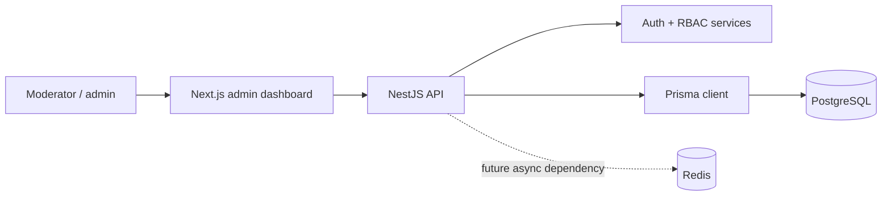

# TrustOps Platform

[](https://github.com/AmiRaGaL/trustops-platform/actions/workflows/ci.yml)


Multi-tenant trust and safety operations platform for reviewing user reports, assigning moderator work, recording decisions, and preserving audit trails.

> Portfolio project disclaimer: TrustOps is a recruiter-facing engineering project, not a production moderation vendor. It demonstrates backend and full-stack architecture patterns with realistic trust and safety workflows, but it intentionally omits production hardening such as managed deployment, ML classifiers, webhooks, and OpenTelemetry.

## Live Demo

- Web dashboard: [trustops-platform-web.vercel.app](https://trustops-platform-web.vercel.app/)
- API health check: [trustops-api.onrender.com/health](https://trustops-api.onrender.com/health)
- Demo login: `mod@trustops.dev` / `Password123!`

What to review:

- Multi-tenant RBAC
- Moderation queue
- Report detail workflow
- Internal notes and actions
- Audit logs
- Deployed full-stack architecture

## What Is TrustOps?

TrustOps is a compact moderation operations system. Users can report content, moderators can review a queue, admins can assign and resolve reports, and every important moderation event is written to an audit trail.

The goal is to show how a production-style internal platform can be designed with clear domain boundaries, tenant scoping, RBAC, validated APIs, relational modeling, and a usable admin dashboard.

## Why This Exists

This repository is built as a portfolio-grade full-stack project. It is meant to be read by engineers and interviewers who want to evaluate practical system design decisions, not just UI polish.

TrustOps demonstrates:

- How to model multi-tenant trust and safety data in PostgreSQL.
- How to keep NestJS controllers thin and move business logic into services.
- How to enforce organization-scoped moderator access.
- How to preserve report history through events and audit logs.
- How to build a Next.js admin dashboard against a typed API client.
- How to keep a demo easy to run locally with seed data and credentials.

## Core Features

- Email/password authentication with hashed passwords and JWT access tokens.
- Users, organizations, memberships, and roles.
- Organization-scoped RBAC for owner, admin, moderator, and viewer roles.
- Content listing and content detail endpoints.
- User report creation and "my reports" lookup.
- Moderator report queue with cursor pagination and filters.
- Report detail view with content, reporter, assignee, events, notes, and action history.
- Assignment flow that moves open reports into review.
- Internal notes for moderator-only context.
- Moderation actions including hide content, warn, suspend, dismiss, escalate, and no action.
- Audit log viewer for moderator/admin activity.
- Next.js admin dashboard for login, overview, queue, report detail, and audit logs.
- Docker Compose dependencies for PostgreSQL and Redis.
- CI-backed API and web lint/test/build checks.

## Tech Stack

| Layer | Technology |
| --- | --- |
| API | NestJS, TypeScript, class-validator |
| Database | PostgreSQL, Prisma ORM and migrations |
| Auth | JWT, Passport, bcryptjs |
| Frontend | Next.js App Router, React, TypeScript |
| Local infrastructure | Docker Compose, Redis, PostgreSQL |
| Testing / CI | Jest, Node test runner, ESLint, GitHub Actions for API and web validation |

## Architecture Overview

TrustOps is a two-app workspace:

- `apps/api`: NestJS API with modules for auth, users, organizations, memberships, content, reports, admin moderation, audit logs, health, and Prisma.
- `apps/web`: Next.js admin dashboard that authenticates through the API and stores the local demo token in browser storage.



More detail:

- [Architecture docs](docs/architecture.md)
- [Database docs](docs/database.md)
- [API docs](docs/api.md)
- [Demo script](docs/demo-script.md)
- [Screenshot guide](docs/screenshots/README.md)
- [Decision records](docs/decisions)

## Screenshots

Screenshot capture instructions and expected views are in [docs/screenshots/README.md](docs/screenshots/README.md).

Suggested screenshot filenames:

- `docs/screenshots/login.png`
- `docs/screenshots/dashboard.png`
- `docs/screenshots/report-queue.png`
- `docs/screenshots/report-detail.png`
- `docs/screenshots/internal-note-panel.png`
- `docs/screenshots/moderation-action-panel.png`
- `docs/screenshots/audit-logs.png`

## Local Setup

Prerequisites:

- Node.js 20+
- Docker and Docker Compose

Install dependencies and prepare local configuration:

```bash
npm install
cp apps/api/.env.example apps/api/.env
cp apps/web/.env.example apps/web/.env.local
docker compose up -d
npm run db:generate -w apps/api
npm run db:migrate -w apps/api
npm run db:seed -w apps/api
```

Run the apps:

```bash
npm run dev -w apps/api
npm run dev -w apps/web
```

Default local URLs:

- API: `http://localhost:3000`
- Web dashboard: `http://localhost:3001` when the API is already using port `3000`

The seed creates demo users with the password `Password123!`, plus sample content and reports for moderation testing.

The web app reads `NEXT_PUBLIC_API_URL` from `apps/web/.env.local`. The API allows the local dashboard origin through `WEB_APP_ORIGIN` in `apps/api/.env`.

## Demo Credentials

The seed script creates local demo users with the password `Password123!`.

| Role | Email |
| --- | --- |
| Owner | `owner@trustops.dev` |
| Admin | `admin@trustops.dev` |
| Moderator | `mod@trustops.dev` |
| Viewer | `viewer@trustops.dev` |
| Demo user | `user1@trustops.dev` |
| Demo user | `user2@trustops.dev` |

Recommended dashboard login:

```text
Email: mod@trustops.dev
Password: Password123!
```

These credentials are for local seed data only.

## API Overview

Primary endpoints:

| Area | Endpoints |
| --- | --- |
| Health | `GET /health` |
| Auth | `POST /auth/register`, `POST /auth/login`, `GET /auth/me` |
| Users | `GET /users/:id` |
| Organizations | `POST /organizations`, `GET /organizations`, `GET /organizations/:id` |
| Memberships | `POST /memberships`, `GET /memberships/organizations/:organizationId`, `GET /memberships/users/:userId` |
| Content | `GET /content`, `GET /content/:id` |
| Reports | `POST /reports`, `GET /reports/my` |
| Admin reports | `GET /admin/reports`, `GET /admin/reports/:id`, `POST /admin/reports/:id/assign`, `POST /admin/reports/:id/notes`, `POST /admin/reports/:id/actions`, `POST /admin/reports/:id/escalate` |
| Audit logs | `GET /admin/audit-logs` |

Admin endpoints require:

```http
Authorization: Bearer <access-token>
```

See [docs/api.md](docs/api.md) for example curl commands and common error cases.

## Testing Commands

CI runs the API migration, API lint/test/build checks, and web lint/test/build checks from `.github/workflows/ci.yml`.

Workspace validation:

```bash
npm install
npm run lint
npm run test
npm run build
```

API only:

```bash
npm run lint -w apps/api
npm run test -w apps/api
npm run build -w apps/api
```

Web only:

```bash
npm run lint -w apps/web
npm run test -w apps/web
npm run build -w apps/web
```

## Deployment

TrustOps deploys with the existing stack only:

- Web dashboard: Vercel
- Backend API: Render
- Database: Supabase Postgres

Live web demo: [https://trustops-platform-web.vercel.app/](https://trustops-platform-web.vercel.app/)

Live API health check: [https://trustops-api.onrender.com/health](https://trustops-api.onrender.com/health)

Demo credentials are seeded into the Supabase-backed demo database and should use synthetic data only.

Deployment setup, environment variables, migrations, seed instructions, verification steps, and troubleshooting are documented in [docs/deployment.md](docs/deployment.md).

## Project Structure

```text
trustops-platform/
  apps/
    api/                 NestJS API workspace
      prisma/            Prisma schema, migrations, seed data
      src/
        admin/           Moderator report and audit log endpoints
        audit-logs/      Audit log query service
        auth/            Login, registration, JWT strategy
        content/         Content listing endpoints
        memberships/     Organization membership APIs
        moderation/      Moderator access checks
        organizations/   Organization APIs
        reports/         User report APIs
        users/           User lookup APIs
    web/                 Next.js admin dashboard
      src/app/           App Router pages
      src/components/    Shared dashboard components
      src/lib/           API client, auth storage, types
  docs/                  Portfolio docs, diagrams, demo guide, decisions
  docker-compose.yml     Local PostgreSQL and Redis dependencies
```

## Security Notes

- Passwords are hashed with bcryptjs before storage.
- JWT secrets are read from environment variables.
- `.env.example` files document required configuration without committing secrets.
- Request DTOs use class-validator for incoming body/query validation.
- Moderator/admin APIs check organization membership before returning or mutating report data.
- Audit logs record actor, organization, action, entity, metadata, and timestamp.
- This demo does not implement production session management, rate limiting, SSO, tenant provisioning, object storage, or external policy integrations.

## Known Limitations

- Portfolio project only; not a production vendor or hosted service.
- No ML classifier or automated policy scoring.
- No webhook delivery or third-party case management integrations.
- No OpenTelemetry instrumentation yet.
- Redis is included as a local dependency, but this phase focuses on synchronous moderation workflows.
- Demo seed data is small by design.
- No production deployment manifest is included.

## Roadmap

- Add production-grade deployment documentation.
- Add OpenTelemetry tracing and structured operational dashboards.
- Add background jobs for notifications and export tasks.
- Add richer audit log retention controls.
- Add policy taxonomy and configurable queues.
- Add end-to-end browser tests for the dashboard demo path.

## Recruiter / Interviewer Talking Points

- The API uses modular NestJS boundaries so controllers stay thin and services own business rules.
- The Prisma schema shows tenant-aware relational modeling with indexes for queue and audit access patterns.
- RBAC is organization-scoped, which matters more than global roles in multi-tenant operations software.
- Report events preserve lifecycle history, while audit logs preserve actor accountability.
- The dashboard is intentionally practical: login, queue, detail workflow, actions, and audit review.
- The project avoids premature ML and integration work so the core workflow remains explainable and testable.

## GitHub Presentation Suggestions

Repository description:

```text
Portfolio-grade multi-tenant trust and safety operations platform built with NestJS, Prisma, PostgreSQL, and Next.js.
```

Suggested topics:

```text
trust-and-safety, moderation, nestjs, nextjs, prisma, postgresql, typescript, rbac, audit-logs, portfolio-project
```
