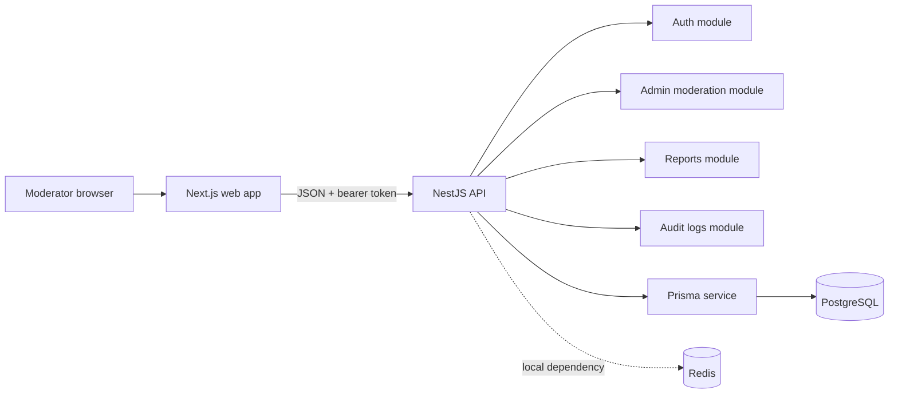
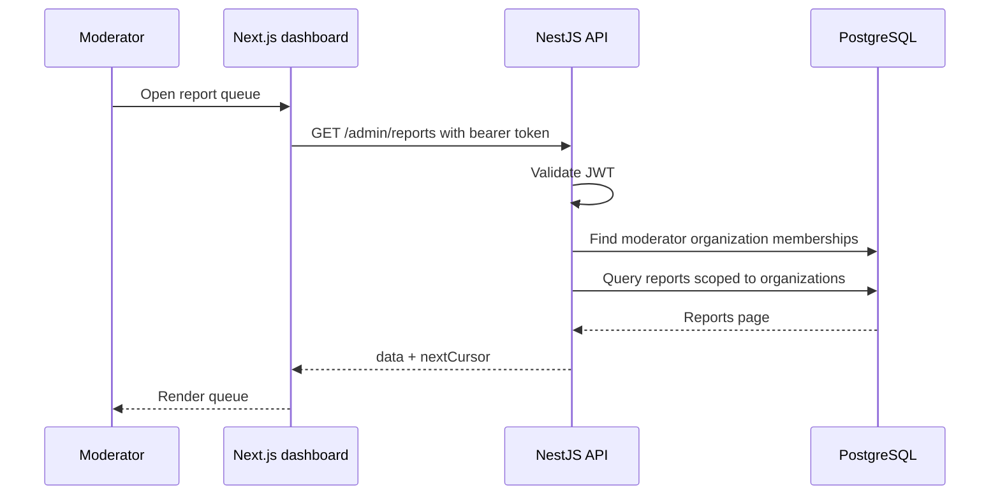
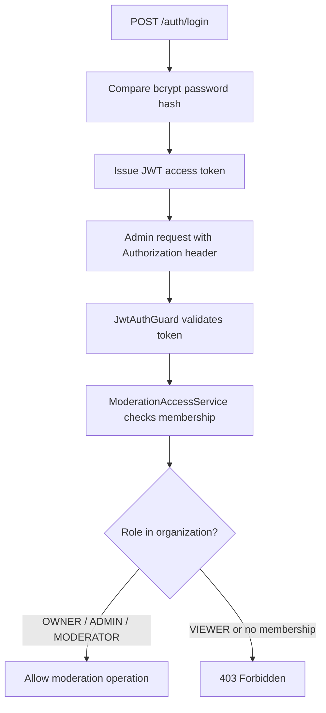
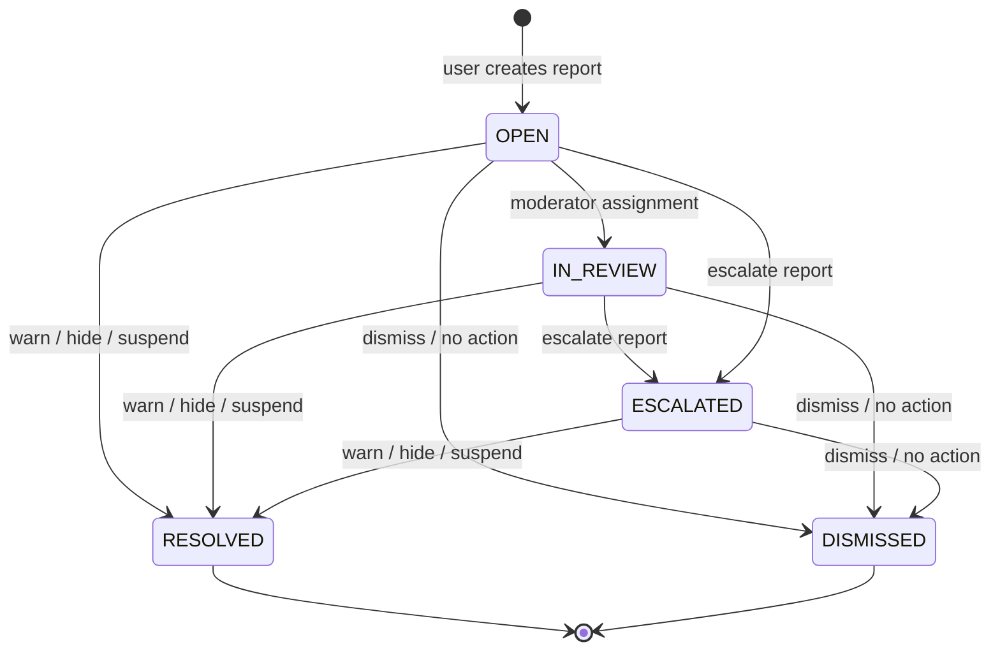
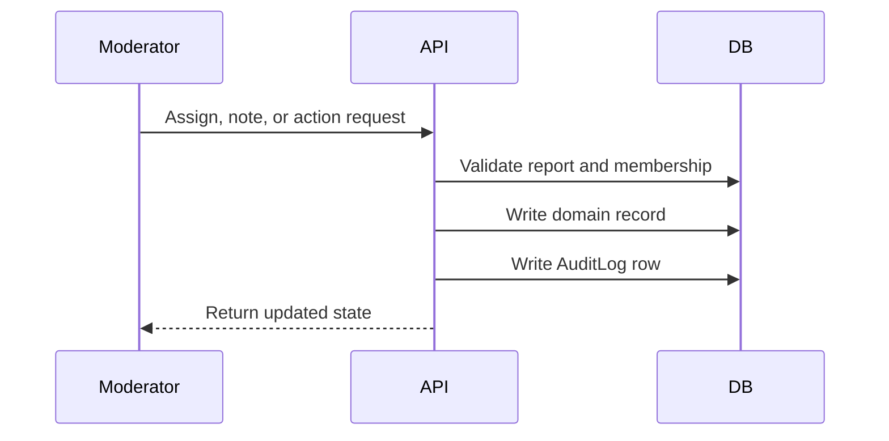

# Architecture

## System Overview

TrustOps is a small multi-tenant trust and safety platform with a NestJS API, a PostgreSQL database accessed through Prisma, and a Next.js admin dashboard.

The current implementation is intentionally direct: API requests execute synchronously, write relational records, and return updated state to the dashboard. Redis is available through Docker Compose for future async workflows, but Phase 4 does not add background jobs.

## Backend Modules

| Module | Responsibility |
| --- | --- |
| `AuthModule` | Registration, login, JWT strategy, current user lookup. |
| `UsersModule` | User lookup. |
| `OrganizationsModule` | Organization creation and retrieval. |
| `MembershipsModule` | User-to-organization role membership management. |
| `ContentModule` | Public content listing and detail retrieval for demo content. |
| `ReportsModule` | User-facing report creation and reporter report history. |
| `AdminModule` | Moderator queue, report detail, assignment, notes, actions, escalation, audit log routes. |
| `ModerationAccessService` | Organization-scoped moderator/admin/owner access checks. |
| `AuditLogsService` | Tenant-scoped audit log listing. |
| `PrismaModule` | Shared Prisma client lifecycle. |
| `HealthModule` | Basic health endpoint. |

## Frontend Pages

| Route | Purpose |
| --- | --- |
| `/login` | Authenticates a seeded moderator/admin/owner with `POST /auth/login`. |
| `/dashboard` | Shows report metrics and recent reports. |
| `/reports` | Shows the moderation queue with filters and cursor pagination. |
| `/reports/[id]` | Shows report detail, assignment, notes, actions, escalation, lifecycle events, and action history. |
| `/audit-logs` | Shows tenant-scoped audit log records. |

## Request Flow

## Auth / RBAC Flow

RBAC is scoped by organization. A user may moderate one organization while having no access to another organization's report data.

## Report Lifecycle Flow

Terminal reports cannot receive new moderation actions. Each status change is represented as a report event.

## Audit Logging Flow

Audit logs record:

- `organizationId`
- `actorUserId`
- `action`
- `entityType`
- `entityId`
- `metadata`
- `createdAt`

## Multi-Tenancy Model

TrustOps uses organization-scoped tenancy:

- `Organization` owns content, reports, memberships, and audit logs.
- `Membership` assigns a user a role within one organization.
- Admin report queries first resolve the actor's moderated organizations.
- Report and audit log queries are constrained to those organization IDs.
- Report detail and mutations verify access against the report's organization before returning data or writing changes.

This keeps tenant isolation visible in the service layer and reflected in database indexes.

## Deployment Assumptions

The current project is optimized for local review and CI:

- PostgreSQL and Redis run locally through Docker Compose.
- The API and web app run as separate Node workspaces.
- GitHub Actions validates the API with PostgreSQL and Redis services.
- Environment variables provide database, JWT, Redis, API URL, and CORS configuration.

Production deployment would need additional work: managed secrets, HTTPS, rate limiting, observability, migrations strategy, backup and retention policy, SSO or stronger auth, and hardened infrastructure.
