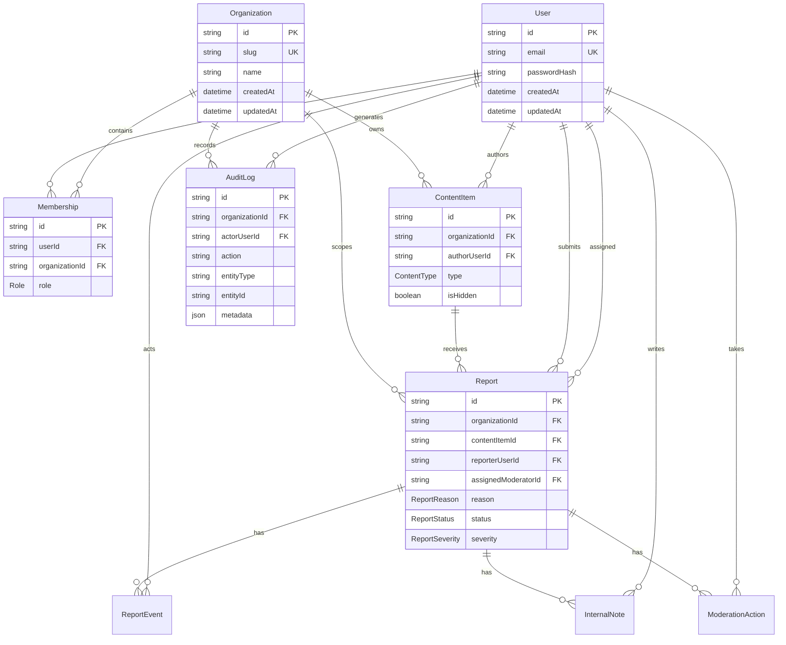

# Database

## Main Entities

| Entity | Purpose |
| --- | --- |
| `User` | Authenticated person with email, optional name, and hashed password. |
| `Organization` | Tenant boundary for memberships, content, reports, and audit logs. |
| `Membership` | Role assignment for a user inside an organization. |
| `ContentItem` | Demo content that can be reported and moderated. |
| `Report` | User-submitted trust and safety report against one content item. |
| `ReportEvent` | Lifecycle event for report status changes. |
| `InternalNote` | Moderator-only note attached to a report. |
| `ModerationAction` | Decision/action taken by a moderator. |
| `AuditLog` | Actor accountability record for administrative operations. |

## Relationship Overview

## Important Indexes

| Model | Index | Why it matters |
| --- | --- | --- |
| `User` | `email` unique | Login and identity lookup. |
| `Organization` | `slug` unique | Stable tenant lookup. |
| `Membership` | unique `userId, organizationId` | Prevents duplicate roles per tenant. |
| `Membership` | `organizationId, role` | Efficient role/member queries inside a tenant. |
| `ContentItem` | `organizationId, type, createdAt` | Tenant-scoped content browsing. |
| `ContentItem` | `organizationId, externalId` | Tenant-scoped external content references. |
| `ContentItem` | `authorUserId` | Author history lookup. |
| `Report` | unique `contentItemId, reporterUserId` | Prevents duplicate reports by the same user for the same content. |
| `Report` | `organizationId, status, createdAt` | Moderator queue filtering and sorting. |
| `Report` | `organizationId, reason` | Queue filtering by policy category. |
| `Report` | `organizationId, severity` | Queue filtering by severity. |
| `Report` | `assignedModeratorId` | Moderator workload lookup. |
| `ReportEvent` | `reportId, createdAt` | Timeline display. |
| `InternalNote` | `reportId, createdAt` | Report detail note history. |
| `ModerationAction` | `reportId, createdAt` | Report action history. |
| `ModerationAction` | `actorUserId` | Moderator action lookup. |
| `AuditLog` | `organizationId, createdAt` | Tenant-scoped audit log feed. |
| `AuditLog` | `actorUserId` | Filter logs by actor. |
| `AuditLog` | `entityType, entityId` | Find audit history for a specific entity. |

## Multi-Tenant Scoping

`organizationId` is the primary tenant boundary. Content, reports, memberships, and audit logs all carry organization context. Admin APIs do not trust client-provided organization IDs for authorization. Instead, they resolve the actor's memberships and constrain reads/writes to organizations where the actor has `OWNER`, `ADMIN`, or `MODERATOR`.

This approach keeps tenant access explicit at the service layer and keeps common access paths index-friendly.

## Audit Log Preservation

Audit logs are separate from report events:

- `ReportEvent` explains the report lifecycle: status transitions and lifecycle messages.
- `AuditLog` explains administrative accountability: who did what to which entity and when.

The current Prisma schema cascades audit logs when an organization is deleted, which is appropriate for a local portfolio demo. A production system would normally define stricter tenant deletion and retention policies before allowing destructive organization deletion.
